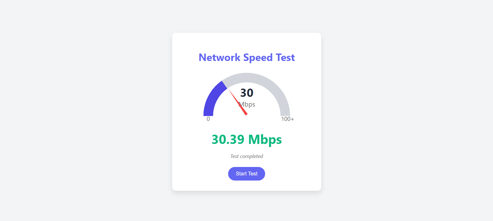

# Network Speed Test

This project is a simple **Network Speed Test** web application built using **HTML**, **CSS**, and **JavaScript**. It allows users to measure their internet download speed by fetching a test file and displaying the result in Mbps (megabits per second). The speed is visually represented using a dynamic gauge with a needle and color changes that correspond to the speed result.

## Features

- **Visual Speed Gauge**: Displays the speed using an SVG-based gauge with a needle that rotates according to the speed, accompanied by color changes to represent different speed ranges.
- **Real-time Speed Display**: Shows the download speed in real-time during the test, updating with animations.
- **Responsive Design**: The layout adapts to different screen sizes, ensuring a consistent user experience on various devices.
- **Dynamic Gauge Fill**: The arc of the speed gauge dynamically fills based on the measured speed.
- **Pulse Effect**: A pulse effect is shown while the test is running, indicating activity.

## How It Works

1. The speed test begins when the user clicks the **Start Test** button.
2. The test fetches a 5MB file from Cloudflare’s test server to simulate a download.
3. The download time is measured, and the download speed is calculated in **Mbps**.
4. The calculated speed is then displayed on the gauge, and the needle rotates to show the speed.
5. Depending on the speed range, the display color changes:
   - Red: Slow speed (< 5 Mbps)
   - Orange: Medium speed (5 - 20 Mbps)
   - Green: Fast speed (20 - 75 Mbps)
   - Violet: Super-fast speed (> 75 Mbps)

## Technologies Used

- **HTML**: Defines the structure of the webpage, including the speed gauge and button.
- **CSS**: Provides the styling, including animations for the gauge, colors, and layout.
- **JavaScript**: Handles the core logic for fetching the test file, calculating the speed, and dynamically updating the UI.

## Project Structure

- `index.html`: The main HTML file that contains the layout and structure of the speed test web page.
- `style.css`: The CSS file that styles the webpage, including the gauge, button, and animations.
- `script.js`: The JavaScript file that contains the logic for fetching the file, calculating speed, and updating the UI.

## How to Run

1. Clone the repository or download the project files.
2. Open the `index.html` file in any modern web browser.
3. Click the **Start Test** button to begin the network speed test.

## Browser Compatibility

This project is compatible with most modern browsers, including:
- Google Chrome
- Mozilla Firefox
- Microsoft Edge
- Safari

## Known Limitations

- The test relies on fetching a file from Cloudflare's speed test server, and the accuracy may vary depending on external factors like network conditions and server response times.
- The gauge is limited to 100 Mbps in terms of display; speeds higher than this will still display as "100+ Mbps".

## Future Enhancements

- Add an option to test **upload speed** in addition to download speed.
- Include more detailed statistics like latency (ping) and jitter.
- Display a history of past speed test results.

## Screenshots

### Speed Test UI

## License

This project is open-source and available under the [MIT License](LICENSE).

